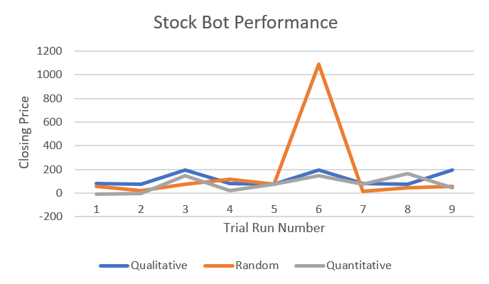
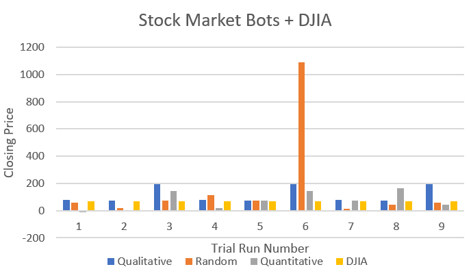

# Qualitative, Quantitative, and Random Stock Trading Methods

## (Building a Sick Stock Trading AI) 

### Background

This repository contains a project I did for my Artificial Intelligence class at the University of Virginia. It contains bots that select stocks based on qualitative, quantitative, and random methods in the aim of best performance. I came up with the project idea and executed it independently of the class.

### Motivation

With Coronavirus tearing through the United States, I have noticed an increase in media coverage regarding the fluctuations in the stock market. Would it be possible to predict the trends of the stock market using an AI?

I set out to build and test out different types of AI that could predict trends in the stock market and buy and sell accordingly. I have not traded stocks heavily before, and I think this will be a useful experiment in this topic. It may also serve useful for those interested in how to take advantage of the turbulence of the stock market at this time.

### Implementation

I took three approaches in experimenting with the stock market, incorporating a random, qualitative, and quantitative approach to stock trading.

* The first approach was to randomly buy and sell stocks. I planned on using this as a benchmark with which to test the latter methods that I implemented. Using an AI that randomly trades will allow us to know if our other approaches are effective or not based on if they can beat this one.
* The second approach was for an AI to buy and sell stocks based on qualitative effects, such as media. I built a web scraping tool that took the top search results for a stock using the Beautiful Soup python module after following a tutorial I found on HackerNoon (1). I then compared each word in the title of a search result to the Affective Norms for English Words (ANEW) dataset, which contains rankings of words based on their connotation complied through a study published in 1999 (2). I used the “Mean Valence” values that indicated the amount of pleasure one got from a word, with higher values meaning happier words. I then took the top value in “Mean Valence” to be the proposed stock.
* The third approach I took was to implement a bot that used a Gaussian Naïve Bayes that relied on whether a stock improved upon its previous stock price. For this, I used the python module, scikit-learn, to assist with this portion as it contains many useful methods for data science (3). I set the amount of data to compare to be 10 days in the past, so a stock that consistently performed well for 10 days was likely to be what was chosen. The inspiration for this came both from class learning on Bayesian networks as well as “Using AI to Make Predictions on Stock Market” by Alice Zheng and Jack Jin (4). In the latter, the authors created AI that utilized different methods such as neural networks and Bayesian networks to predict the stock market. 

The training data I used was a data set of the Dow Jones Industrial Average’s 30 companies that I found on Kaggle, a website hosting many free datasets (5). I mainly used closing price data, the price that a stock is at when the market closes, beginning at June 23rd, 2008, and ending on December 29th, 2017. I am interested in long-term investment, considering I am an incredibly inexperienced trader. I would like the convenience of investing in a stock once and then letting it sit until I decide to cash it out. Therefore, the best performing AI from this project will be the one that produces the best long-term gain. 

### Methodology

I developed three bots and ran them from a central main.py file. 

I ran each bot 3 times and each bot chose 3 stocks per run. I then compared the closing price of the starting date to the closing price of the ending date. The period between the two dates was about 10 years, which I thought was a great amount of time for measuring long-term stock investment. 

### Results

I found that in the nine test runs performed, the qualitative stock bot tended to do the best consistently. The quantitative stock bot performed almost as well, although it was the only bot to choose stocks that fell into the negative over the ten-year period. The random stock bot got lucky during some of the trial runs before these nine, and actually chose Amazon as a stock during these 9, which is why there’s a gigantic rise on trial 6 for the random stock bot. Below is a graph comparing the three stock bots during the trial runs.
 

I also included this graph of a comparison of each stock choice from the bot with the average of the DJIA at the end date. The qualitative stock bot performed just as well, if not the same as the DJIA during each trail. The random stock bot tended to vary wildly in its comparisons to the DJIA while the quantitative bot underperformed in some cases while performing significantly better in others.
 

### Results Discussion

After performing this project, it appears that our society’s opinions on stocks in the stock market have a significant effect on how they perform. If I were to have chosen 9 stocks in 2008 based on how positive people were about them on the internet, I would have outperformed the market in each case. Compare this to taking into account the data of past stock performance via the quantitative method, and this finding is even more surprising. Coming into this project, I would have thought that the quantitative approach would have outright beat its competitors, but this is not the case. The shortcomings of the quantitative approach are shown even more by the ability of the random stock bot to happen upon a stock, like Amazon, that shoots for the moon over a ten year period.

In the future, I plan on refining my quantitative bot to consider data over a much longer time period as well as data from a company’s financial reports. If a company were to be performing well, not only on the stock market, but also on their balance sheets, I think that would make for more useful data for the bot. A bot that could take into account this could determine healthy companies to invest in with its previous track record of figures alone. 

I also plan on looking into making a more sophisticated qualitative bot, especially because of its merit in performing this project. I think that applying Natural Language Processing techniques to browser searches and Twitter would make for an even more powerful AI to use. A bot that reacted to news on a much greater time frame about a stock could make for an incredibly useful bot to manage my financial portfolio. 
For now, I plan on giving the random stock bot control of some of my money to use in trading. Its proven that it can get the stocks right some of the time and outperform the market. Its configured currently for a local dataset, but I have found brokerage API online that I seem to have merit. I just hope it finds the Amazon stock instead of losing all my money. 

### Conclusion

I enjoyed this project very much, and I am glad I chose to do this rather than skipping it in favor of the problem sets. I had a crash course in the world of finance and got to combine that with my AI knowledge to make a project that I am very proud of. I hope that you find this to be useful to you, and to your ventures into the tumultuous stock market. It seems that the opinions of society have a large weight on which stocks are a good choice to pick, but I am still convinced that the cold hard numbers of a company’s values are the better option. The numbers behind a company do not fall prey to societal speculations about a company, but clearly getting a reliable quantitative bot will require further study and trial and error in order to beat the qualitative bot.

 
### Works Cited
1.	https://hackernoon.com/how-to-scrape-google-with-python-bo7d2tal
2.	Bradley, Margaret M. and Peter J. Lang. “Affective Norms for English Words (ANEW): Instruction Manual and Affective Ratings.” (1999).
3.	https://scikit-learn.org/stable/modules/generated/sklearn.naive_bayes.GaussianNB.html#sklearn.naive_bayes.GaussianNB
4.	A. Zheng, J. Jin, Using ai to make predictions on stock market, 2017.
5.	https://www.kaggle.com/szrlee/stock-time-series-20050101-to-20171231
